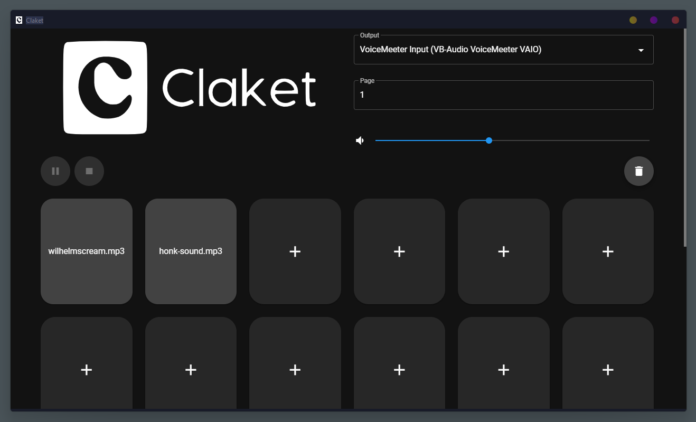

# Claket

## Description
Claket is a simple soundboard palette developed with [neutralinojs](https://github.com/neutralinojs/neutralinojs) 

## Disclaimer
Not tested on Mac and Linux, it probably doesn't work
## Features
- Sound :
    - Add
    - Delete
    - Play
    - Pause
    - Stop
    - Toggle Loop
- Playback :
    - Active 
    - Desactive
- Volume
- Pages :
    - Choose
    - Reset
- Choose Audio Output

## Download
Download from [Releases](https://github.com/aera128/claket-soundboard/releases)
## Screenshot

